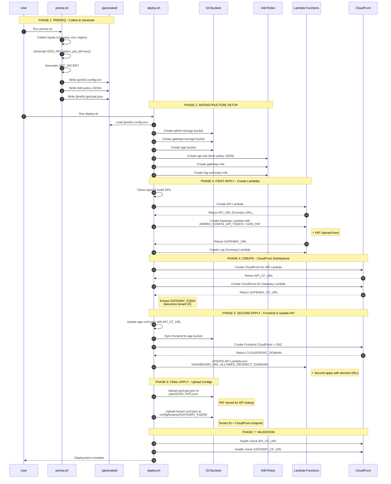

# Airbrx Deploy

Self-service deployment toolkit for the Airbrx Data Gateway stack.

## Usage

Runs in **AWS CloudShell** or any bash environment with AWS CLI v2 and Node.js 20+.

```bash
git clone https://github.com/airbrx/airbrx-deploy.git
cd airbrx-deploy
./prereq.sh
```

The `prereq.sh` script will guide you through configuration and optionally run `deploy.sh` when complete.

To clean up all deployed resources:

```bash
./cleanup.sh
```

## Requirements

- **AWS CLI v2** configured with appropriate permissions
- **Node.js 20+** (for building Lambda packages)
- **GitHub PAT** with read access to private Airbrx repositories:
  - `airbrx/data-proxy`
  - `airbrx/airbrx-api`
  - `airbrx/app-airbrx-com`

Optional:
- Descope Project ID (for OAuth login)
- Anthropic API Key (for AI-powered log analysis)
- Slack Webhook (for notifications)

## Minimum IAM Permissions

The user running these scripts needs the following permissions:

```
S3:
  - s3:CreateBucket
  - s3:PutBucketVersioning
  - s3:PutBucketPublicAccessBlock
  - s3:PutBucketPolicy
  - s3:GetBucketLocation
  - s3:ListBucket
  - s3:PutObject
  - s3:GetObject
  - s3:DeleteObject

Lambda:
  - lambda:CreateFunction
  - lambda:UpdateFunctionCode
  - lambda:UpdateFunctionConfiguration
  - lambda:GetFunction
  - lambda:GetFunctionConfiguration
  - lambda:CreateFunctionUrlConfig
  - lambda:GetFunctionUrlConfig
  - lambda:AddPermission
  - lambda:DeleteFunction (for cleanup)

IAM:
  - iam:CreateRole
  - iam:GetRole
  - iam:PutRolePolicy
  - iam:DeleteRolePolicy (for cleanup)
  - iam:DeleteRole (for cleanup)
  - iam:PassRole
  - iam:ListRolePolicies
  - iam:ListAttachedRolePolicies

CloudFront:
  - cloudfront:CreateDistribution
  - cloudfront:UpdateDistribution
  - cloudfront:GetDistribution
  - cloudfront:GetDistributionConfig
  - cloudfront:ListDistributions
  - cloudfront:DeleteDistribution (for cleanup)
  - cloudfront:CreateInvalidation
  - cloudfront:CreateOriginAccessControl
  - cloudfront:GetOriginAccessControl
  - cloudfront:DeleteOriginAccessControl (for cleanup)
  - cloudfront:ListOriginAccessControls

STS:
  - sts:GetCallerIdentity

Logs (for cleanup):
  - logs:DeleteLogGroup
```

In AWS CloudShell, users typically inherit broad permissions from their console session. For restricted environments, the generated `{prefix}-deployer-policy.json` contains a scoped policy.

## What Gets Deployed

| Component | Type | Purpose |
|-----------|------|---------|
| `{prefix}-airbrx-api` | Lambda + Function URL | Admin API, configuration management |
| `{prefix}-airbrx-gateway` | Lambda + Function URL | Data proxy, request handling |
| `{prefix}-airbrx-log-summary` | Lambda (internal) | AI-powered log analysis |
| `{prefix}-airbrx-admin-storage` | S3 Bucket | Config, tenant data, PATs |
| `{prefix}-airbrx-gateway-storage` | S3 Bucket | Cache, logs, summaries |
| `{prefix}-airbrx-app` | S3 + CloudFront | Frontend web application |

## Architecture

```
                                    +---------------------+
                                    |   CloudFront CDN    |
                                    |  (Frontend App)     |
                                    +----------+----------+
                                               |
+----------------------------------------------+----------------------------------------------+
|                                              |                                    AWS       |
|  +---------------------+    +----------------+----------------+    +---------------------+  |
|  |  S3: admin-storage  |<---|      Lambda: airbrx-api        |--->|  S3: gateway-storage|  |
|  |  - tenant configs   |    |      (Function URL)            |    |  - cache            |  |
|  |  - PATs             |    +----------------+----------------+    |  - logs             |  |
|  +---------------------+                     |                    |  - summaries        |  |
|                                              | invoke             +----------+----------+  |
|                                              v                               |             |
|                              +-------------------------------+               |             |
|                              |   Lambda: airbrx-log-summary  |---------------+             |
|                              |   (internal, no URL)          |                             |
|                              +-------------------------------+                             |
|                                                                                            |
|  +---------------------------------------+                                                 |
|  |      Lambda: airbrx-gateway           |<--- External clients (Snowflake, etc.)         |
|  |      (Function URL)                   |                                                 |
|  +---------------------------------------+                                                 |
+--------------------------------------------------------------------------------------------+
```

## Deployment Flow

The deployment follows a specific sequence to handle artifact dependencies. Key artifacts like the GOD_PAT and CloudFront endpoints must be created before they can be injected into dependent resources.



### Flow Summary

| Phase | Action | Key Artifacts |
|-------|--------|---------------|
| **1. Collect** | `prereq.sh` gathers inputs | GOD_PAT, JWT_SECRET, IAM policies |
| **2. Infrastructure** | Create S3 buckets and IAM roles | Storage and execution roles ready |
| **3. First Apply** | Create Lambdas with Function URLs | Gateway receives PAT via env var |
| **4. Create** | CloudFront distributions | API_CF_URL, GATEWAY_FQDN extracted |
| **5. Second Apply** | Deploy frontend, update API Lambda | DASHBOARD_URL, redirect domains |
| **6. Final Apply** | Upload PAT and tenant config to S3 | Tenant ID = GATEWAY_FQDN |
| **7. Validate** | Health checks | Confirm endpoints responding |

### Critical Dependencies

```
prereq.sh                    deploy.sh
    │                            │
    ├─► GOD_PAT ────────────────►├─► Gateway Lambda env var
    │                            │
    │                            ├─► S3: pats/{GOD_PAT}.json
    │                            │
    └─► config.env ─────────────►├─► Lambda creation
                                 │
                                 ├─► CloudFront ──► GATEWAY_FQDN
                                 │                      │
                                 │                      ▼
                                 └─► S3: config/tenants/{GATEWAY_FQDN}/conf.json
                                            (cloudFilesBaseUrl uses GATEWAY_FQDN)
```

**Why the multi-pass approach?**
- The Gateway Lambda needs the GOD_PAT to authenticate with the API — injected at creation time
- The API Lambda needs CloudFront URLs for redirects — but CloudFront doesn't exist until after Lambdas are created
- The initial tenant config uses the Gateway's CloudFront domain as its tenant ID — this can only happen after CloudFront is provisioned
- The PAT must be stored in S3 so the API can validate tokens the Gateway sends

## Generated Files

After running `prereq.sh`, the `generated/` folder contains:

| File | Purpose |
|------|---------|
| `{prefix}-config.env` | Deployment configuration (sensitive!) |
| `{prefix}-god-pat.json` | Admin API token (uploaded to S3) |
| `{prefix}-lambda-trust-policy.json` | Trust policy for lambda roles |
| `{prefix}-airbrx-api-policy.json` | API lambda permissions |
| `{prefix}-airbrx-gateway-policy.json` | Gateway lambda permissions |
| `{prefix}-airbrx-log-summary-policy.json` | Log-summary lambda permissions |
| `{prefix}-deployer-policy.json` | Permissions for deploy.sh executor |

> **Note:** The `generated/` folder is gitignored. Never commit these files.

## Security Notes

- IAM roles follow least-privilege principle (separate role per lambda)
- No AWS keys in code - uses session credentials and IAM roles
- God PAT and JWT secret are auto-generated with secure randomness
- All sensitive files in `generated/` are gitignored
- Config files have restricted permissions (600)

## License

Proprietary - Airbrx Inc.
